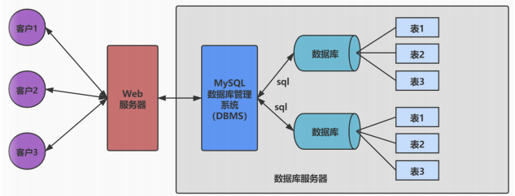
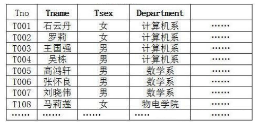
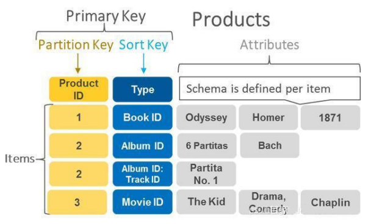
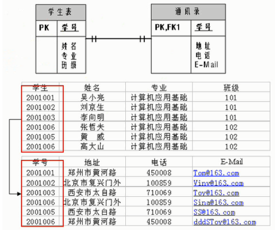
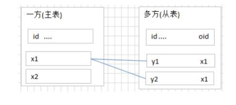
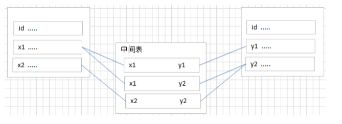
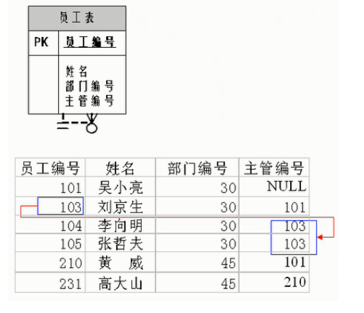

# MySQL 基础篇

## 第 01 章：数据库概述与环境搭建

### 数据库基础知识

1. 使用数据库的目的：将**数据持久化**保存，如将内存中的数据存储在**关系型数据库**、磁盘文件、XML 数据文件中

2. 数据库(DB)与数据库管理系统(DBMS)关系

   

3. 关系型数据库(RDBMS)

   概述：

   

   - **以 行(row) 和 列(column) 的形式存储数据**，一系列的行和列称为 表(table)，一组表组成了一个库(database)
   - 是建立在 **关系模型** 基础上的数据库，表与表之间的数据记录有关系（relationship）
   - 如Oracle、MySQL、SQL Server

   优势：

   - **复杂查询** 可用SQL语句方便的在一个表以及多个表之间做复杂的数据查询
   - **事务支持** 使得对于安全性能很高的数据访问要求得以实现

4. 非关系型数据库

   

   - **基于键值对存储数据**，不需要经过SQL层的解析 ，减少不常用功能提高性能

### 关系型数据库设计规则


```
ORM(Object Relational Mapping)思想：
数据库中表 <--> Java中类
表中的数据 <--> 类实例化的对象
表中的列 <--> 类的属性
```

#### 一对一关联

建表原则：

- **外键唯一**：主表的主键和从表的外键（唯一），形成主外键关系
- **外键是主键**：主表的主键和从表的主键，形成主外键关系



#### 一对多关联

建表原则：

- 从表(多方)创建一个字段，字段作为外键指向主表(一方)的主键



#### **多对多**

建表原则：

- 创建联接表，将多对多关系划分为两个一对多关系



#### 自我引用



### 使用Docker安装mysql

1. **安装Docker** https://docs.docker.com/get-docker/

2. **拉取MySQL镜像**

   ```bash
   docker pull mysql:latest
   ```

3. **运行MySQL容器**

   ```bash
   docker run --name mysql-container -e MYSQL_ROOT_PASSWORD=your_password -d -p 3306:3306 mysql:latest
   # docker run -name 容器名称 -e 设置环境变量 -d 后台模式运行容器 -p 将主机端口映射到容器端口 mysql:latest 指定运行MYSQL容器镜像
   ```

4. **连接到MySQL**

   ```bash
   mysql -h 127.0.0.1 -P 3306 -u root -p
   # mysql -h 主机名 -P 端口号 -u 用户名 -p密码
   ```

   

### MySQL启动与登录

```bash
# 默认mysql服务名为mysql
# 启动服务 - 拒绝访问时使用管理员权限执行
net start mysql 
# 停止服务
net stop mysql
# 登录mysql
mysql -h localhost -P 3306 -u root -p
# 查看版本
mysql -V 
登陆后 select version();
# 退出登录
exit 
quit
```

### MySQL使用演示

```sql
# 关键词推荐使用大写形式

# 查看全部数据库 
SHOW DATABASES;

# 创建数据库
CREATE DATABASE honghuang;

# 使用数据库
USE honghuang;

# 查看某个库的所有表格
SHOW TABLES;
SHOW TABLES FROM honghuang;

# 创建新的表格 
# CREATE TABLE 表名称(
# 	字段名 数据类型,
# 	字段名 数据类型
# );
CREATE TABLE faction(
    id int,
    name varchar(20)
);

# 查看一个表的数据 
# SELECT * FROM 数据库表名称;
SELECT * FROM faction;

# 添加记录
# INSERT INTO 表名称 VALUES(值列表);
INSERT INTO faction VALUES(1, '截教');
INSERT INTO faction VALUES(2, '阐教');

# 查看表的创建信息
SHOW CREATE TABLE faction;

# 查看数据库的创建信息
SHOW CREATE DATABASE honghuang;

# 删除表格
DROP TABLE faction;

# 删除数据库
DROP DATABASE honghuang;
```


## 第02章 SQL之SELECT使用篇

### SQL的分类

1. **DDL**（Data Definition Languages、数据定义语言）：
   - 定义不同数据库、表、视图、索引等数据库对象；或创建、删除、修改数据库和数据表的结构
   - 如：`CREATE`、`DROP`、`ALTER`、`RENAME`、`TRUNCATE`
2. **DML**（Data Manipulation Language、数据操作语言）：
   - 用于添加、删除、更新和查询数据库记录，并检查数据完整性
   - 如：`INSERT` 、`DELETE` 、 `UPDATE` 、 `SELECT`
3. **DCL**（Data Control Language、数据控制语言）：
   - 定义数据库、表、字段、用户的访问权限和安全级别
   - 如： `GRANT` 、 `REVOKE` 、 `COMMIT` 、 `ROLLBACK` 

### SQL语言的规则与规范   

见PDF

### 基础的SELECT语句

```bash
# 数据导入指令 登录后使用source指令
mysql>  source d:\mysqldb.sql
```
#### 查看表结构 DESC

```sql
# 查看表的结构和列信息
DESC employees;
DESCRIBE employees;
```

```bash
+-------------+--------------+------+-----+---------+-------+
| Field       | Type         | Null | Key | Default | Extra |
+-------------+--------------+------+-----+---------+-------+
| employee_id | int(11)      | NO   | PRI | NULL    |       |
| first_name  | varchar(50)  | YES  |     | NULL    |       |
| last_name   | varchar(50)  | YES  |     | NULL    |       |
| email       | varchar(100) | YES  |     | NULL    |       |
| hire_date   | date         | YES  |     | NULL    |       |
+-------------+--------------+------+-----+---------+-------+

# Field 列显示表中的列名
# Type 列显示了每个列的数据类型
# Null 列指示该列是否允许包含 NULL 值
# Key 列指示该列是否是键，如主键（PRI）或索引（MUL）
# Default 列显示了该列的默认值
# Extra 列包含附加信息，如 "auto_increment" 等
```

#### 选择数据 SELECT ... FROM

```sql
# 选择全部列
SELECT * FROM employees;
SELECT * FROM atguigudb.employees;

# 选择特定的列
SELECT first_name, last_name FROM employees;

# 列的别名 使用AS关键词或者列名后紧跟别名
SELECT last_name AS name FROM employees;
SELECT email mail FROM employees;
SELECT last_name "Name", salary * 12 "Annual Salary" FROM employees;

# 去除重复行 默认返回重复行 DISTINCT去重
SELECT department_id FROM employees;
SELECT DISTINCT department_id FROM employees;

# 空值参与运算
# 所有运算符或列值遇到null值，运算的结果都为null

SELECT employee_id, commission_pct， salary "月工资",salary * (1 + commission_pct) * 12 "年工资"
FROM employees; ❌

# 引入IFNULL 
# 语法 IFNULL(expr, replacement)
# expr: 检查是否为NULL的表达式或列 replacement: expr为NULL的替换值
SELECT employee_id, commission_pct, salary "月工资",salary * (1 + IFNULL(commission_pct,0)) * 12 "年工资"
FROM employees; ✔️

# 着重号 ``
# order为保留字
SELECT * FROM order; ❌
SELECT * FROM `order`; ✔️

# 查询常数
SELECT '打工人', employee_id, last_name FROM employees;
```


#### 过滤数据  SELECT... FROM ... WHERE

```bash
语法:  SELECT 字段1, 字段2 FROM 表名 WHERE 过滤条件
```

```sql
# 查询90号部门的员工信息
SELECT * FROM employees WHERE department_id = 90;
# 查询last_name为'King'的员工信息
SELECT * FROM employees WHERE last_name = 'King';
```

