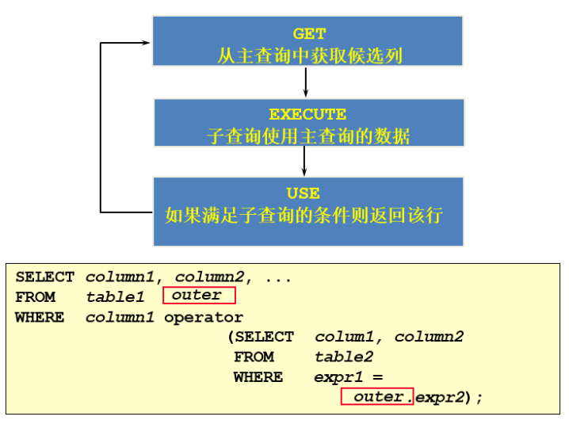

# MySQL 基础篇

## 第 01 章：数据库概述与环境搭建

### 数据库基础知识

1. 使用数据库的目的：将**数据持久化**保存，如将内存中的数据存储在**关系型数据库**、磁盘文件、XML 数据文件中

2. 数据库(DB)与数据库管理系统(DBMS)关系

   

3. 关系型数据库(RDBMS)

   概述：

   

   - **以 行(row) 和 列(column) 的形式存储数据**，一系列的行和列称为 表(table)，一组表组成了一个库(database)
   - 是建立在 **关系模型** 基础上的数据库，表与表之间的数据记录有关系（relationship）
   - 如Oracle、MySQL、SQL Server

   优势：

   - **复杂查询** 可用SQL语句方便的在一个表以及多个表之间做复杂的数据查询
   - **事务支持** 使得对于安全性能很高的数据访问要求得以实现

4. 非关系型数据库

   

   - **基于键值对存储数据**，不需要经过SQL层的解析 ，减少不常用功能提高性能

### 关系型数据库设计规则


```
ORM(Object Relational Mapping)思想：
数据库中表 <--> Java中类
表中的数据 <--> 类实例化的对象
表中的列 <--> 类的属性
```

#### 一对一关联

建表原则：

- **外键唯一**：主表的主键和从表的外键（唯一），形成主外键关系
- **外键是主键**：主表的主键和从表的主键，形成主外键关系


#### 一对多关联

建表原则：

- 从表(多方)创建一个字段，字段作为外键指向主表(一方)的主键


#### **多对多**

建表原则：

- 创建联接表，将多对多关系划分为两个一对多关系


#### 自我引用


### 使用Docker安装mysql

1. **安装Docker** https://docs.docker.com/get-docker/

2. **拉取MySQL镜像**

   ```bash
   docker pull mysql:latest
   ```

3. **运行MySQL容器**

   ```bash
   docker run --name mysql-container -e MYSQL_ROOT_PASSWORD=your_password -d -p 3306:3306 mysql:latest
   # docker run -name 容器名称 -e 设置环境变量 -d 后台模式运行容器 -p 将主机端口映射到容器端口 mysql:latest 指定运行MYSQL容器镜像
   ```

4. **连接到MySQL**

   ```bash
   mysql -h 127.0.0.1 -P 3306 -u root -p
   # mysql -h 主机名 -P 端口号 -u 用户名 -p密码
   ```

   

### MySQL启动与登录

```bash
# 默认mysql服务名为mysql
# 启动服务 - 拒绝访问时使用管理员权限执行
net start mysql 
# 停止服务
net stop mysql
# 登录mysql
mysql -h localhost -P 3306 -u root -p
# 查看版本
mysql -V 
登陆后 select version();
# 退出登录
exit 
quit
```

### MySQL使用演示

```sql
# 关键词推荐使用大写形式

# 查看全部数据库 
SHOW DATABASES;

# 创建数据库
CREATE DATABASE honghuang;

# 使用数据库
USE honghuang;

# 查看某个库的所有表格
SHOW TABLES;
SHOW TABLES FROM honghuang;

# 创建新的表格 
# CREATE TABLE 表名称(
# 	字段名 数据类型,
# 	字段名 数据类型
# );
CREATE TABLE faction(
    id int,
    name varchar(20)
);

# 查看一个表的数据 
# SELECT * FROM 数据库表名称;
SELECT * FROM faction;

# 添加记录
# INSERT INTO 表名称 VALUES(值列表);
INSERT INTO faction VALUES(1, '截教');
INSERT INTO faction VALUES(2, '阐教');

# 查看表的创建信息
SHOW CREATE TABLE faction;

# 查看数据库的创建信息
SHOW CREATE DATABASE honghuang;

# 删除表格
DROP TABLE faction;

# 删除数据库
DROP DATABASE honghuang;
```


## 第02章 SQL之SELECT使用篇

### SQL语言的规则与规范   

#### SQL的分类

1. **DDL**（Data Definition Languages、数据定义语言）：
   - 定义不同数据库、表、视图、索引等数据库对象；或创建、删除、修改数据库和数据表的结构
   - 如：`CREATE`、`DROP`、`ALTER`、`RENAME`、`TRUNCATE`
2. **DML**（Data Manipulation Language、数据操作语言）：
   - 用于添加、删除、更新和查询数据库记录，并检查数据完整性
   - 如：`INSERT` 、`DELETE` 、 `UPDATE` 、 `SELECT`
3. **DCL**（Data Control Language、数据控制语言）：
   - 定义数据库、表、字段、用户的访问权限和安全级别
   - 如： `GRANT` 、 `REVOKE` 、 `COMMIT` 、 `ROLLBACK` 


### 基础的SELECT语句

```bash
# 数据导入指令 登录后使用source指令
mysql>  source d:\mysqldb.sql
```
#### 查看表结构 DESC

```sql
# 查看表的结构和列信息
DESC employees;
DESCRIBE employees;
```

```bash
+-------------+--------------+------+-----+---------+-------+
| Field       | Type         | Null | Key | Default | Extra |
+-------------+--------------+------+-----+---------+-------+
| employee_id | int(11)      | NO   | PRI | NULL    |       |
| first_name  | varchar(50)  | YES  |     | NULL    |       |
| last_name   | varchar(50)  | YES  |     | NULL    |       |
| email       | varchar(100) | YES  |     | NULL    |       |
| hire_date   | date         | YES  |     | NULL    |       |
+-------------+--------------+------+-----+---------+-------+

# Field 列显示表中的列名
# Type 列显示了每个列的数据类型
# Null 列指示该列是否允许包含 NULL 值
# Key 列指示该列是否是键，如主键（PRI）或索引（MUL）
# Default 列显示了该列的默认值
# Extra 列包含附加信息，如 "auto_increment" 等
```

#### 选择数据 SELECT ... FROM

```sql
# 选择全部列
SELECT * FROM employees;
SELECT * FROM atguigudb.employees;

# 选择特定的列
SELECT first_name, last_name FROM employees;

# 列的别名 使用AS关键词或者列名后紧跟别名
SELECT last_name AS name FROM employees;
SELECT email mail FROM employees;
SELECT last_name "Name", salary * 12 "Annual Salary" FROM employees;

# 去除重复行 默认返回重复行 DISTINCT去重
SELECT department_id FROM employees;
SELECT DISTINCT department_id FROM employees;

# 空值参与运算
# 所有运算符或列值遇到null值，运算的结果都为null

SELECT employee_id, commission_pct， salary "月工资",salary * (1 + commission_pct) * 12 "年工资"
FROM employees; ❌

# 引入IFNULL 
# 语法 IFNULL(expr, replacement)
# expr: 检查是否为NULL的表达式或列 replacement: expr为NULL的替换值
SELECT employee_id, commission_pct, salary "月工资",salary * (1 + IFNULL(commission_pct,0)) * 12 "年工资"
FROM employees; ✔️

# 着重号 ``
# order为保留字
SELECT * FROM order; ❌
SELECT * FROM `order`; ✔️

# 查询常数
SELECT '打工人', employee_id, last_name FROM employees;
```


#### 过滤数据  SELECT... FROM ... WHERE

```bash
语法:  SELECT 字段1, 字段2 FROM 表名 WHERE 过滤条件
WHERE 必须紧跟在FROM后面
```
用于筛选行，只有满足特定条件的行才会被包括在结果集中，在 WHERE 子句中，**别名通常是不可见的**

```sql
# 查询90号部门的员工信息
SELECT * FROM employees WHERE department_id = 90;
# 查询last_name为'King'的员工信息
SELECT * FROM employees WHERE last_name = 'King';
```

#### 练习

```sql
# 1.查询员工12个月的工资总和，并起别名为ANNUAL SALARY
SELECT
	last_name,
	salary * 12 * ( 1 + IFNULL ( commission_pct, 0 ) ) "ANNUAL SALARY" 
FROM
	employees;

# 2.查询employees表中去除重复的job_id以后的数据
SELECT DISTINCT job_id FROM employees; 

# 3.查询工资大于12000的员工姓名和工资
SELECT last_name, salary FROM employees WHERE salary > 12000;

# 4.查询员工号为176的员工的姓名和部门号
SELECT last_name, department_id FROM employees WHERE employee_id = 176;

# 5.显示表 departments 的结构，并查询其中的全部数据
DESC departments;
SELECT * FROM departments;
```


### 运算符

#### 符号运算符

```sql
# 整数类型的值对浮点数进行加减乘除操作，结果为浮点数
SELECT 1 + 1.5   FROM dual; => 2.5
# +号: 只表示数值相加，如果遇到非数值类型，先尝试转成数值，转换失败按0计算
1 + '1.5' => 2.5
1 + 'A' => 1
'A' + 'A' => 0
# /号: 除不尽时，保留4为小数
1 / 3 => 0.3333
# 数值除以0为NULL
1 / 0 => NULL
# =号: 判断等号两边的值、字符串或表达式是否相等，相等返回1，不相等返回0; 字符与数值比较将字符转为数值再比较、与NULL比较结果为NULL
1 = '1' => 1
1 = NULL => NULL
NULL = NULL => NULL
# 安全等于运算符(<=>): 可对NULL进行比较
0 <=> NULL => 0
NULL <=> NULL => 1
# 不等于运算符(<>和!=): 判断等式不相等，不相等返回1，相等返回0; 不能判断NULL值返回NULL
1 <> 1 => 0
1 != 2 => 1
1 != NULL => NULL
NULL != NULL => NULL
```

#### 非符号运算符


```sql
# LIKE:  匹配字符串常用于模糊匹配; 满足条件返回1,否则返回0,若给定值或匹配条件为NULL，则返回NULL
# %: 匹配0个或多个字符
# _: 只能匹配1个字符

#练习：查询第3个字符是'a'的员工信息
SELECT * FROM employees WHERE first_name LIKE '__a%';
```


#### 逻辑运算符


```sql
-- 逻辑异或（XOR）运算符: 追求的"异"
-- 任意值为NULL时，则返回NULL; 如果两个值都是0或者都不等于0时，则返回0; 如果两个值不同则返回1

select last_name,department_id,salary
from employees
where department_id in (10,20) XOR salary > 8000;
```


#### 练习

```sql
# 1.选择工资不在5000到12000的员工的姓名和工资
SELECT last_name, salary
FROM employees 
WHERE NOT salary BETWEEN 5000 AND 12000;
# 2.选择在20或50号部门工作的员工姓名和部门号
SELECT last_name, department_id 
FROM employees
WHERE department_id IN (20, 50);
# 3.选择公司中没有管理者的员工姓名及job_id
SELECT last_name, job_id
FROM employees
WHERE manager_id IS NULL;
# 4.选择公司中有奖金的员工姓名，工资和奖金
SELECT first_name, last_name, salary, salary * commission_pct 
FROM employees 
WHERE commission_pct IS NOT NULL;
# 5.选择员工姓名的第三个字母是a的员工姓名
SELECT first_name 
FROM employees 
WHERE first_name LIKE '__a%';
# 6.选择姓名中有字母a和k的员工姓名
SELECT first_name 
FROM employees 
WHERE first_name LIKE '%a%k%' OR first_name LIKE '%k%a%';
# 7.显示出表 employees 表中 first_name 以 'e'结尾的员工信息
SELECT first_name 
FROM employees 
WHERE first_name LIKE '%e';
# 8.显示出表 employees 部门编号在 80-100 之间的姓名、工种
SELECT first_name, job_id 
FROM employees 
WHERE department_id BETWEEN 80 AND 100;
# 9.显示出表 employees 的 manager_id 是 100,101,110 的员工姓名、工资、管理者id
SELECT first_name, salary, manager_id 
FROM employees 
WHERE manager_id IN (100,101,110);
```


### 排序与分页

#### 排序

```sql
SELECT ...
FROM ...
ORDER BY 字段 ASC; 
# ASC(ascend): 升序
# DESC(descend) 降序
# ORDER BY 子句在SELECT语句的结尾
```

```sql
# 单列排序
SELECT last_name, job_id, department_id, hire_date
FROM employees
ORDER BY hire_date DESC;

# 多列排序 - 前一列必须有相同的列值，才会对下一列进行排序
SELECT last_name, department_id, salary
FROM employees
ORDER BY department_id, salary DESC;
```

#### 分页

```sql
# mysql 使用LIMIT实现分页
LIMIT [位置偏移量,] 行数
#8.0 新特性 
LIMIT 行数 OFFSET 偏移量;
# LIMIT 子句必须放在整个SELECT语句最后
```

```sql
SELECT last_name
FROM employees
LIMIT 0, 10;
```

### 多表查询

—— 指两个或更多个表一起完成查询操作，前提是查询的表具有关联关系

```sql
#案例：查询员工的姓名及其部门名称
SELECT last_name, department_name
FROM employees, departments; ❌ 笛卡尔积的错误


# 查询结果：2889行
+-----------+----------------------+
| last_name | department_name      |
+-----------+----------------------+
| King      | Administration       |
| King      | Marketing            |
| King      | Purchasing           |
| King      | Human Resources      |
| King      | Shipping             |
| King      | IT                   |
| King 		| Public Relations     |
| King 		| Sales                |
| King	    | Executive            |
| King 		| Finance              |
| King 		| Accounting           |
| King 		| Treasury             |
...
```


#### 笛卡尔积(交叉连接)

> **表的笛卡尔积**：在关系数据库中，如果有两个表 A 和 B，它们之间没有明确的连接条件，那么它们的笛卡尔积将是一个包含了所有可能组合的表


```sql
# 交叉连接 CROSS JOIN
SELECT last_name,department_name FROM employees CROSS JOIN departments;

# 避免笛卡尔积 在 WHERE 子句加入有效的连接条件
SELECT last_name, department_name
FROM employees, departments
WHERE employees.department_id = departments.department_id;

```


#### 等值连接 vs 非等值连接

- 表中有相同列时，在列名前加上表名前缀 
- 使用别名可以简化查询, 但在查询字段、过滤字段只能使用别名

```sql
# 等值连接
SELECT e.employee_id, e.last_name, e.department_id,
d.department_id, d.location_id
FROM employees e , departments d
WHERE e.department_id = d.department_id;
# 使用别名 防止异常：Column 'name' in field list is ambiguous
```

```sql
# 非等值连接
SELECT e.last_name, e.salary, j.grade_level 
FROM employees e, job_grades j
WHERE e.salary BETWEEN j.lowest_sal AND j.highest_sal;
```


#### 自连接 vs 非自连接

```sql
# 自连接 同表相连
SELECT
	CONCAT( worker.last_name, ' works for ', manager.last_name ) 
FROM
	employees worker,
	employees manager 
WHERE
	worker.manager_id = manager.employee_id;
```


#### 内连接 vs 外连接

内连接: 合并具有同一列的两个以上的表的行, **结果集中不包含一个表与另一个表不匹配的行**

外连接：返回满足连接条件行外，还返回不满足条件的行，列中的数据为空

```sql
# 内连接
SELECT 字段列表
FROM A表 INNER JOIN B表
ON 关联条件
WHERE 等其他子句;

SELECT e.employee_id, e.last_name, e.department_id,
d.department_id, d.location_id
FROM employees e INNER JOIN departments d
ON e.department_id = d.department_id;
# 结果106行
```


```sql
# 左外连接 - 包含主表连接条件为NULL的行
SELECT 字段列表
FROM A表 LEFT JOIN B表
ON 关联条件
WHERE 等其他子句;

SELECT e.last_name, e.department_id, d.department_name
FROM employees e
LEFT OUTER JOIN departments d
ON (e.department_id = d.department_id);

# 结果107行
+-----------+----------------------+
| last_name | department_name      |
+-----------+----------------------+
| King      | Administration       |
| Grant     | NULL                 |  
```

```sql
# 右外连接 - 包含从表连接条件为NULL的行
SELECT 字段列表
FROM A表 RIGHT JOIN B表
ON 关联条件
WHERE 等其他子句;

SELECT e.last_name, e.department_id, d.department_name
FROM employees e
RIGHT OUTER JOIN departments d
ON (e.department_id = d.department_id);

# 结果122行
+-----------+----------------------+
| last_name | department_name      |
+-----------+----------------------+
| King      | Administration       |
| NULL      | Treasury             | 
| NULL      | Corporate Tax        |
...
```

```sql
 # 满外连接
 # SQL99支持满外连接 使用FULL JOIN 或 FULL OUTER JOIN来实现
 # MySQL不支持FULLJOIN 使用 LEFT JOIN UNION RIGHT JOIN代替
 
SELECT e.last_name, e.department_id, d.department_name
FROM employees e
FULL OUTER JOIN departments d
ON (e.department_id = d.department_id); ❌
```


#### UNION 合并查询结果

```sql
# UNION 组合多条SELECT语句的结果集 需要列与数据类型都相同
# UNION 返回并集并去除重复记录
# UNION ALL 返回并集，不去重
SELECT column,... FROM table1
UNION [ALL]
SELECT column,... FROM table2

# 查询部门编号>90或邮箱包含a的员工信息
SELECT * FROM employees WHERE email LIKE '%a%'
UNION
SELECT * FROM employees WHERE department_id>90;
```


#### SQL JOINS的实现


```sql
# 内连接 A∩B
SELECT employee_id,last_name,department_name
FROM employees e JOIN departments d
ON e.`department_id` = d.`department_id`;
```

```sql
# 左上图: 左外连接
SELECT employee_id,last_name,department_name
FROM employees e LEFT JOIN departments d
ON e.`department_id` = d.`department_id`;
```

```sql
# 右上图: 右外连接
SELECT employee_id,last_name,department_name
FROM employees e LEFT JOIN departments d
ON e.`department_id` = d.`department_id`;
```

```sql
#左中图: A - A∩B
SELECT employee_id,last_name,department_name
FROM employees e LEFT JOIN departments d
ON e.`department_id` = d.`department_id`
WHERE d.`department_id` IS NULL
```

```sql
#右中图: B - A∩B
SELECT employee_id,last_name,department_name
FROM employees e RIGHT JOIN departments d
ON e.`department_id` = d.`department_id`
WHERE e.`department_id` IS NULL
```

```sql
#左下图：满外连接
# 左中图 + 右上图 A∪B
SELECT employee_id,last_name,department_name
FROM employees e LEFT JOIN departments d
ON e.`department_id` = d.`department_id`
WHERE d.`department_id` IS NULL
UNION ALL #无去重操作，效率高
SELECT employee_id,last_name,department_name
FROM employees e RIGHT JOIN departments d
ON e.`department_id` = d.`department_id`;

# 语法格式
select 字段列表
from A表 left join B表
on 关联条件
where 等其他子句
union
select 字段列表
from A表 right join B表
on 关联条件
where 等其他子句;
```

```sql
#右下图
#左中图 + 右中图 A ∪B- A∩B 或者 (A - A∩B) ∪ （B - A∩B）
SELECT employee_id,last_name,department_name
FROM employees e LEFT JOIN departments d
ON e.`department_id` = d.`department_id`
WHERE d.`department_id` IS NULL
UNION ALL
SELECT employee_id,last_name,department_name
FROM employees e RIGHT JOIN departments d
ON e.`department_id` = d.`department_id`
WHERE e.`department_id` IS NULL

# 语法格式
select 字段列表
from A表 left join B表
on 关联条件
where 从表关联字段 is null and 等其他子句
union
select 字段列表
from A表 right join B表
on 关联条件
where 从表关联字段 is null and 等其他子句
```

 

#### SQL99新特性

1. `NATURAL JOIN` 自然连接 - 自动查询两张连接表中**所有相同的字段**后， 进行等值连接

   ```sql
   SELECT employee_id,last_name,department_name
   FROM employees e NATURAL JOIN departments d;
   ```

2. `USING` 连接 -配合JOIN， 指定数据表里的同名字段进行等值连接

   ```sql
   SELECT employee_id,last_name,department_name
   FROM employees e JOIN departments d
   USING (department_id);
   ```

   

#### 练习

```sql
-- 显示所有员工的姓名，部门号和部门名称
SELECT last_name, e.department_id, department_name 
FROM employees e
LEFT JOIN departments d ON e.department_id = d.department_id;

-- 查询90号部门员工的job_id和90号部门的location_id名称
SELECT last_name, job_id, location_id
FROM employees 
NATURAL JOIN departments 
WHERE employees.department_id = 90;

-- 选择所有有奖金的员工的 last_name , department_name , location_id , city
SELECT last_name , department_name , l.location_id , city
FROM employees e
LEFT JOIN departments d ON e.department_id = d.department_id 
LEFT JOIN locations l ON d.location_id = l.location_id
WHERE e.commission_pct IS NOT NULL;

-- 选择city在Toronto工作的员工的 last_name , job_id , department_id , department_name 
SELECT  last_name , job_id , d.department_id , d.department_name 
FROM employees e
LEFT JOIN departments d ON e.department_id = d.department_id 
LEFT JOIN locations l ON d.location_id = l.location_id
WHERE l.city = 'Toronto';
```

### 单行函数

—— 接受参数返回一个结果

1. 只对一行进行变换，每行返回一个结果
2. 单行函数可以嵌套
3. 参数可以是一列或一个值

#### 数值函数

```sql
# CEIL(x) 向上取整
# FLOOR(x) 向下取整
# RAND(x) 返回0-1的随机数
# ROUND(x) 四舍五入
# TRUNCATE(x,y) 返回数字x截断为y位小数的结果
```

#### 字符串函数

```sql
# CHAR_LENGTH(s) 返回字符串s的字符数
# LENGTH(s) 返回字符串s的字节数
# CONCAT(s1,s2,......,sn) 连接s1,s2,......,sn为一个字符串
# CONCAT_WS(x, s1,s2,......,sn) 同上, 并在字符间加上x
```

#### 日期时间函数

```sql
# CURDATE() 返回当前日期，只包含年、月、日
# CURTIME() 返回当前时间，只包含时、分、秒
# NOW() 返回当前系统日期和时间
```

#### 流程控制函数

```sql
# IF(value,value1,value2)
# value的值为TRUE，返回value1，否则返回value2
SELECT last_name,salary,IF(salary >= 6000,'高工资','低工资') "details"
FROM employees;

# IFNULL(value1, value2)
# 如果value1不为NULL，返回value1，否则返回value2
SELECT IFNULL(null,'Hello Word') FROM DUAL;

# CASE WHEN ... THEN ...WHEN ... THEN ... ELSE ... END
SELECT last_name,salary,CASE WHEN salary >= 15000 THEN '白骨精' 
WHEN salary >= 10000 THEN '潜力股' WHEN salary >= 8000 THEN '小屌丝' ELSE '草根' END "details",department_id
FROM employees;

# CASE ... WHEN ... THEN ... WHEN ... THEN ... ELSE ... END
SELECT employee_id,last_name,department_id,salary,CASE department_id WHEN 10 THEN salary * 1.1 WHEN 20 THEN salary * 1.2 WHEN 30 THEN salary * 1.3 ELSE salary * 1.4 END "details"
FROM employees;
```

#### 加密与解密函数

```sql 
# PASSWORD(str) 8.0弃用
SELECT MD5('爱'), SHA('爱') FROM DUAL;
```

#### 信息函数


#### 练习

```sql
# 1.显示系统时间(注：日期+时间)
SELECT NOW(), SYSDATE() FROM DUAL;

# 2.查询员工号，姓名，工资，以及工资提高百分之20%后的结果（new salary）
SELECT employee_id, last_name, salary , IFNULL(salary,0) * 1.2 'new salary'  FROM employees;

# 3.将员工的姓名按首字母排序，并写出姓名的长度（length）
SELECT last_name, CHAR_LENGTH(last_name) length FROM employees ORDER BY last_name ASC;

# 4.查询员工id,last_name,salary，并作为一个列输出，别名为OUT_PUT
SELECT CONCAT_WS(' ',employee_id, last_name, salary) OUT_PUT FROM employees;

# 5.查询公司各员工工作的年数、工作的天数，并按工作年数的降序排序
SELECT last_name, DATEDIFF(NOW(),hire_date) / 365 year, DATEDIFF(NOW(),hire_date) day FROM employees ORDER BY year DESC;

# 6.查询员工姓名，hire_date , department_id，满足以下条件：
#雇用时间在1997年之后，department_id 为80 或 90 或110, commission_pct不为空
SELECT last_name, hire_date , department_id FROM employees WHERE YEAR(hire_date) AND department_id IN (80, 90, 110) AND commission_pct IS NOT NULL;

# 7.查询公司中入职超过10000天的员工姓名、入职时间
SELECT last_name, hire_date FROM employees WHERE DATEDIFF(CURDATE(),hire_date) >= 10000;
```


### 聚合函数

—— 作用于一组数据，并对一组数据返回一个值


```sql
# 语法
SELECT [column,] group function(column), ...
FROM table
[WHERE condition]
[GROUP BY column]
[ORDER BY column];
```

> 聚合函数不能嵌套调用

#### AVG SUM 

```sql
# AVG SUM - 适用于数值类型
SELECT AVG(salary), MAX(salary),MIN(salary), SUM(salary)
FROM employees
WHERE job_id LIKE '%REP%';
```

#### MIN MAX

```sql
# MIN MAX - 适用于数值类型、字符串类型、日期时间类型
SELECT MIN(hire_date), MAX(hire_date)
FROM employees;
```

#### COUNT

```sql
# COUNT - 计算指定字段在结果集出现的次数 不包含NULL值
SELECT COUNT(*)
FROM employees
WHERE department_id = 50;
```

`count(*)，count(1)，count(列名)`  复杂度都是O(n)， 但`count(列名)` 不会统计值为`NULL`的行

#### GROUP BY

—— 将表中的数据分成若干组


```sql
# GROUP BY 语法
SELECT column, group_function(column)
FROM table
[WHERE condition]
[GROUP BY group_by_expression]
[ORDER BY column];
```

```sql
# 查询各个department_id,job_id的平均工资
SELECT department_id,job_id,AVG(salary)
FROM employees
GROUP BY department_id; ❌

SELECT department_id dept_id, job_id, AVG(salary)
FROM employees
GROUP BY department_id, job_id;
```

1. `SELECT`中出现的非组函数的字段必须声明在`GROUP BY` 中
2. `GROUP BY` 声明在`FROM、WHERE`后面，`ORDER BY LIMIT`前面


#### WITH ROLLUP

1. 在所有查询出的分组记录之后增加一条记录，计算查询出的所有记录的总和
2. `ROLLUP`和`ORDER BY`是互相排斥

```sql
SELECT department_id, AVG(salary)
FROM employees
WHERE department_id > 80
GROUP BY department_id WITH ROLLUP;
```

#### HAVING

`HAVING` 用来过滤数据的


```sql
#练习：查询各个部门中最高工资比10000高的部门信息
SELECT department_id,MAX(salary)
FROM employees
WHERE MAX(salary) > 10000
GROUP BY department_id; ❌

SELECT department_id,MAX(salary)
FROM employees
GROUP BY department_id
HAVING MAX(salary) > 10000;
```

1. **若过滤条件中使用聚合函数，必须使用HAVING 代替 WHERE**
2. 使用`HAVING`的前提是SQL中使用`GROUP BY`


#### 练习

```sql
# 查询各job_id的员工工资的最大值，最小值，平均值，总和, 员工人数
SELECT job_id, COUNT(1), MAX(salary),  MIN(salary),  AVG(salary), SUM(salary) FROM employees GROUP BY job_id;

# 查询各个管理者手下员工的最低工资，其中最低工资不能低于6000，没有管理者的员工不计算在内
SELECT manager_id, MIN(salary) 
FROM employees 
WHERE manager_id IS NOT NULL
GROUP BY manager_id HAVING MIN(salary) > 6000;

# 查询所有部门的名字，location_id，员工数量和平均工资，并按平均工资降序
SELECT d.department_name,d.location_id,COUNT(employee_id),AVG(salary) "avg_salary"
FROM departments d LEFT JOIN employees e
ON d.`department_id` = e.`department_id`
GROUP BY department_name,location_id
ORDER BY avg_salary DESC;

# 查询每个工种、每个部门的部门名、工种名和最低工资 
SELECT d.department_name,e.job_id,MIN(salary)
FROM departments d LEFT JOIN employees e
ON d.`department_id` = e.`department_id`
GROUP BY department_name, job_id;
```

### 子查询

——  在主查询之前一次执行完成，结果供主查询使用


1. 子查询要包含在括号内
2. 将子查询放在比较条件的右侧
3. 单行操作符对应单行子查询（返回一条数据），多行操作符对应多行子查询（返回多条数据）

#### 单行子查询

操作符 `= > >= < <= <>`

```sql
# 查询工资大于149号员工工资的员工的信息
SELECT last_name, salary 
FROM employees 
WHERE salary > 
	(SELECT salary FROM employees WHERE employee_id = 148);
	
# 题目：查询与141号或174号员工的manager_id和department_id相同的其他员工的employee_id，manager_id，department_id
SELECT employee_id, manager_id, department_id 
FROM employees 
WHERE (manager_id, department_id) IN 
	(SELECT manager_id, department_id FROM employees WHERE employee_id IN (141, 174)) 
AND employee_id NOT IN  (141, 174);

# 题目：查询最低工资大于50号部门最低工资的部门id和其最低工资
SELECT department_id, MIN(salary) "min_salary"
FROM employees 
GROUP BY department_id
HAVING min_salary > (SELECT MIN(salary) FROM employees WHERE department_id = 50);

# 题目：显式员工的employee_id,last_name和location。其中，若员工department_id与location_id为1800的department_id相同，则location为’Canada’，其余则为’USA’。
SELECT
	employee_id,
	last_name,
	( CASE department_id WHEN ( SELECT department_id FROM departments WHERE location_id = 1800 ) THEN "Canada" ELSE "USA" END ) location 
FROM
	employees;
```

#### 多行子查询


```sql
# 题目：返回其它job_id中比job_id为‘IT_PROG’部门任一工资低的员工的员工号、姓名、job_id 以及salary
SELECT employee_id, last_name, job_id, salary 
FROM employees
WHERE job_id != "IT_PROG" 
AND salary < 
	ANY(SELECT salary FROM employees WHERE job_id = "IT_PROG");
	
```

#### 相关子查询



```sql
# 题目：查询员工中工资大于本部门平均工资的员工的last_name,salary和其department_id

# 相关子查询
SELECT
	last_name,
	salary,
	department_id 
FROM
	employees e 
WHERE
	salary > ( SELECT AVG( salary ) FROM employees WHERE department_id = e.department_id );
	

# 在FORM中使用子查询
SELECT last_name, salary, e1.department_id 
FROM employees e1, 
	( SELECT department_id, AVG( salary ) dept_avg_sal FROM employees GROUP BY department_id ) e2 
WHERE
	e1.department_id = e2.department_id 
	AND e2.dept_avg_sal < e1.salary;
```


### SELECT 执行过程

#### 查询结构

```sql
# sql92语法
SELECT ..., ... (存在聚合函数)
FROM ..., ...
WHERE 多表的连接条件
AND 不包含聚合函数的过滤条件
GROUP BY ..., ...
HAVING 包含聚合函数的过滤条件
ORDER BY ..., ... (ASC/DESC)
LIMIT ..., ...

# sql99语法
SELECT ..., ... (存在聚合函数)
FROM ... (LEFT / RIGHT) JOIN ... ON 多表连接条件
(LEFT / RIGHT) JOIN ... ON
WHERE 不包含聚合函数的过滤条件
GROUP BY ..., ...
HAVING 包含聚合函数的过滤条件
ORDER BY ..., ... (ASC/DESC)
LIMIT ..., ...

# 其中
# FORM: 从哪些表筛选
# ON: 关联多表查询时，去除笛卡尔积
# WHERE: 从表中筛选的条件
# GROUP BY: 分组依据
# HAVING: 在统计结果中再次筛选
# ORDER BY: 排序
# LIMIT: 分页
```

#### 执行顺序

```sql
# 关键字顺序
SELECT ... FROM ... WHERE ... GROUP BY ... HAVING ... ORDER BY ... LIMIT ...

# 语句执行顺序
FROM -> ON -> (LEFT/RIGNT  JOIN) -> WHERE -> GROUP BY -> HAVING -> SELECT -> DISTINCT(去重) -> ORDER BY -> LIMIT
```

